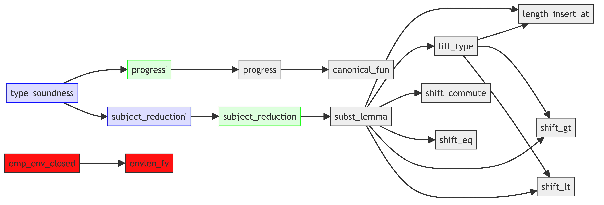

# isabelle-deps

A dependency analyzer for Isabelle proof files.

This tool analyzes an Isabelle `.thy` file and generates a dependency graph of proofs, rendered as a Mermaid flow diagram.

**Important note:**
The script works by heuristically decomposing words using regular expressions.
It does **not** parse Isabelle syntax and is therefore **not robust**.
As a result, it may fail or produce incorrect results on some proof scripts.

## Output

Each node in the generated graph corresponds to a proof item and is color-coded as follows:

- lemma: light gray
- theorem: light blue
- corollary: light green
- **lemma or corollary that no theorem depends on: red**

For example,
here is the ouput of [STLC.thy](./STLC.thy):


In the generated graph:

- `type_soundness` is highlighted in light blue because it is a theorem.
- `progress'` and `subject_reduction'` are highlighted in light green because they are corollaries.
- All other lemmas are shown in light gray, except for `emp_env_closed` and `envlen_fv`.
- `emp_env_closed` and `envlen_fv` are highlighted in RED because they are NOT used in the proof of any theorem.

## Usage

### Requirements

- [Poetry](https://python-poetry.org/) (Python dependency management)
- [mermaid-cli](https://github.com/mermaid-js/mermaid-cli) (for rendering graphs)

### Generate a dependency graph

```bash
bash gengraph.sh YourProof.thy
```

This command generates the following output:

```text
depgraph.png
```

If you are interested, you may want to take a look at the shell script [gengraph.sh](./gengraph.sh).

### Example

```bash
bash gengraph.sh STLC.thy
```
