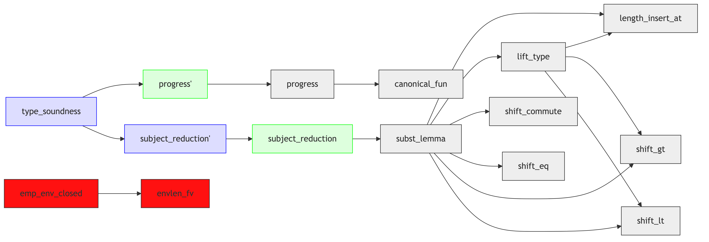

# A dependency analyzer for Isabelle proof files.

This tool analyzes an Isabelle `.thy` file and generates a dependency graph of proofs, rendered as a Mermaid flow diagram.

> [!NOTE]
> The script works by heuristically decomposing words using regular expressions.
> It does not parse Isabelle syntax and is therefore not robust.
> As a result, it may fail or produce incorrect results on some proof scripts.

## Usage

### Requirements

- Python 3.9+
- Pip

### Installation

Install the tool using pip:

```bash
git clone https://github.com/sano-jin/isabelle-deps.git
cd isabelle-deps
pip install -e .
```

After installation, the `isabelle-deps` command will be available.

### Generate Mermaid dependency graph

The primary use of this tool is to generate a dependency graph in Mermaid format from an Isabelle `.thy` file.

```bash
isabelle-deps YourProof.thy
```

This prints the Mermaid graph to standard output.

You can redirect it to a file:

```bash
isabelle-deps YourProof.thy > depgraph.mmd
```

### Example

```bash
cd demo
isabelle-deps STLC.thy > depgraph.mmd
```

You can then render the Mermaid file using any Mermaid-compatible tool if needed.

For example,
here is the ouput of [demo/STLC.thy](./demo/STLC.thy):


Each node in the generated graph corresponds to a proof item and is color-coded as follows:

- lemma: light gray
- theorem: light blue
- corollary: light green
- **lemma or corollary that no theorem depends on: red**

In the generated graph:

- `type_soundness` is highlighted in light blue because it is a theorem.
- `progress'` and `subject_reduction'` are highlighted in light green because they are corollaries.
- All other lemmas are shown in light gray, except for `emp_env_closed` and `envlen_fv`.
- `emp_env_closed` and `envlen_fv` are highlighted in RED because they are NOT used in the proof of any theorem.

### Notes

- This tool does not perform rendering. It only generates Mermaid text.
- Rendering (e.g., to PNG/SVG) can be done separately using tools like `mmdc` if desired.

  For example:

  ```bash
  mmdc -i depgraph.mmd -o depgraph.png -s 10
  ```
